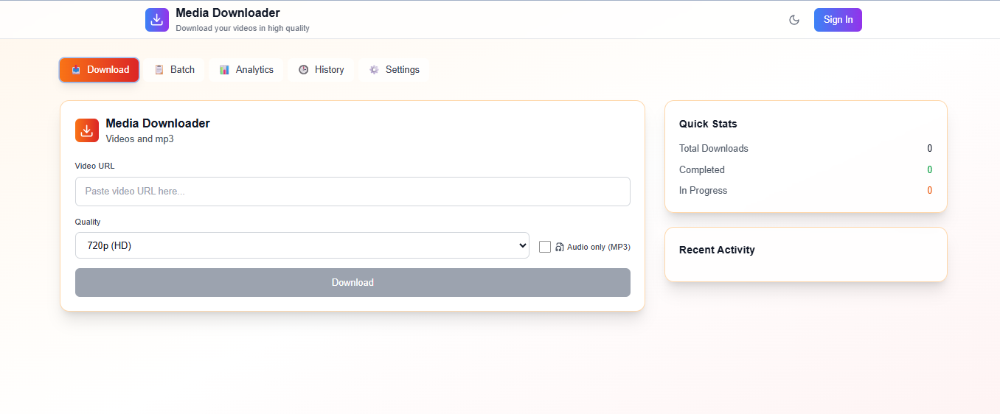
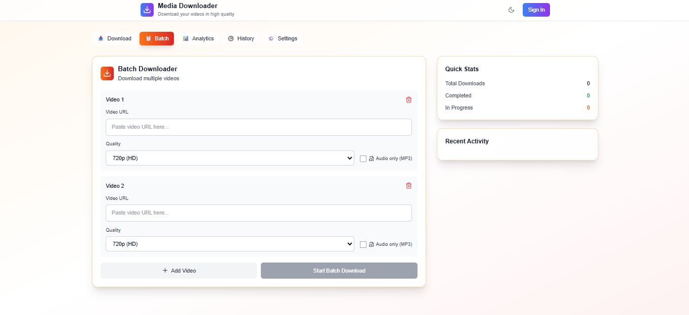
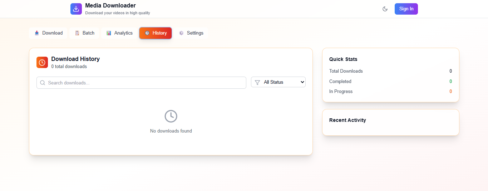
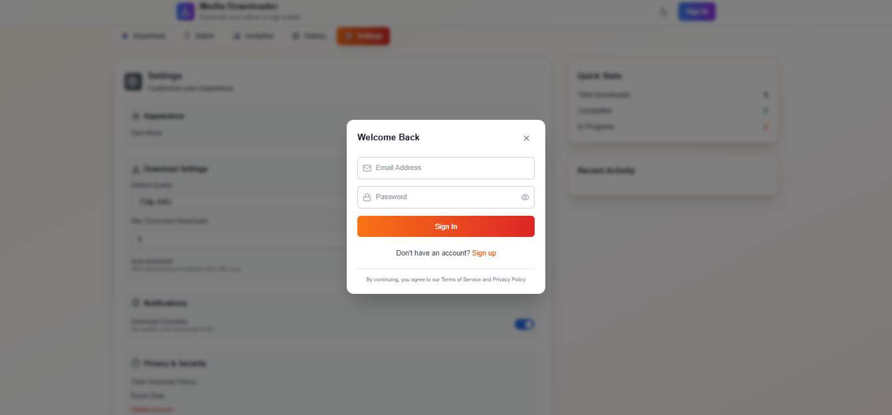
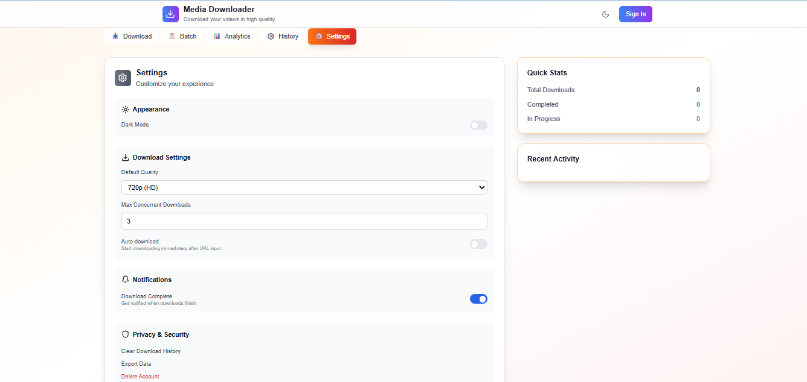

Media Downloader and Analyzer
A web application for downloading and analyzing media from various platforms with AI-powered insights. This project is for educational purposes only and should only be used to download content you have explicit permission to access.
Features

Multi-platform Support: Download videos from supported platforms
Quality Selection: Choose from 360p, 720p, or 1080p
Audio-only Downloads: Extract MP3 audio from videos
Real-time Analysis: AI-powered sentiment analysis, keyword extraction, and engagement metrics
Batch Processing: Download multiple videos simultaneously
User Dashboard: Track download history and analytics
Export Functionality: Export analytics to CSV format
Dark Mode: Beautiful dark/light theme support
Responsive Design: Works on desktop, tablet, and mobile

Screenshots
Below are screenshots showcasing the application's features:
Video Downloader Interface

Input a media URL, select quality, and start downloading.
Monitor real-time download progress with a progress bar.

give multiple urls in the batch downloader page to download the multiple videos

after completing the download in the download and batch download page it automatically navigates to the history page to download to local storage

there is a login option so that user can save his data

we can the settings in settings page

Prerequisites
Before running this application, ensure you have:

Node.js (v16 or higher): Download
Python (v3.7 or higher): Download
yt-dlp: Install globally with:pip install yt-dlp

Installation

Clone the repository:
git clone https://github.com/your-username/media-downloader.git
cd media-downloader

Install Node.js dependencies:
npm install

Install yt-dlp:
pip install yt-dlp

Create a .env file in the project root with:
VITE_API_URL=http://localhost:3001

Running the Application
Development Mode
Run both frontend and backend simultaneously:
npm run dev:full

Or run separately:
Backend only:
npm run server

Frontend only:
npm run dev

The application will be available at:

Frontend: http://localhost:5173
Backend API: http://localhost:3001

API Endpoints

POST /api/video-info: Fetch video metadata
POST /api/download: Initiate video download
GET /api/download-status/:id: Check download status
GET /api/downloads: Retrieve all downloads
POST /api/export: Export analytics data

Usage

Analyze Media: Paste a valid media URL to view metadata.
Download: Select quality and format, then click "Download."
Track Progress: Monitor downloads in real-time.
View Analytics: Access AI-generated insights after download completion.
Export Data: Export analytics to CSV.

Technical Stack
Frontend

React 18 with TypeScript
Tailwind CSS for styling
Lucide React for icons
Vite for build tooling

Backend

Node.js with Express
yt-dlp for media downloading
Real-time progress tracking
File system storage

Project Structure
├── src/
│   ├── components/          # React components
│   ├── services/           # API service layer
│   └── App.tsx            # Main application
├── server/
│   └── index.cjs          # Backend server
├── screenshots/           # Screenshots for README
└── package.json

Contributing

Fork the repository.
Create a feature branch (git checkout -b feature/your-feature).
Make your changes and test thoroughly.
Commit your changes (git commit -m "Add your feature").
Push to the branch (git push origin feature/your-feature).
Open a pull request.

License
This project is for educational purposes only. Users are responsible for complying with the terms of service of any platform they access using this tool. Respect copyright laws and only download content you have permission to use.
Troubleshooting
Common Issues

yt-dlp not found: Ensure yt-dlp is installed globally (pip install yt-dlp).
Download fails: Verify the URL is valid and publicly accessible. Private or restricted videos may return an error.
CORS errors: Ensure both frontend (port 5173) and backend (port 3001) are running.

Support
For issues, check the GitHub Issues page or create a new issue.
Disclaimer
This tool is intended for educational use and personal projects. Do not use it to download copyrighted content without permission. The developers are not responsible for misuse of this tool.